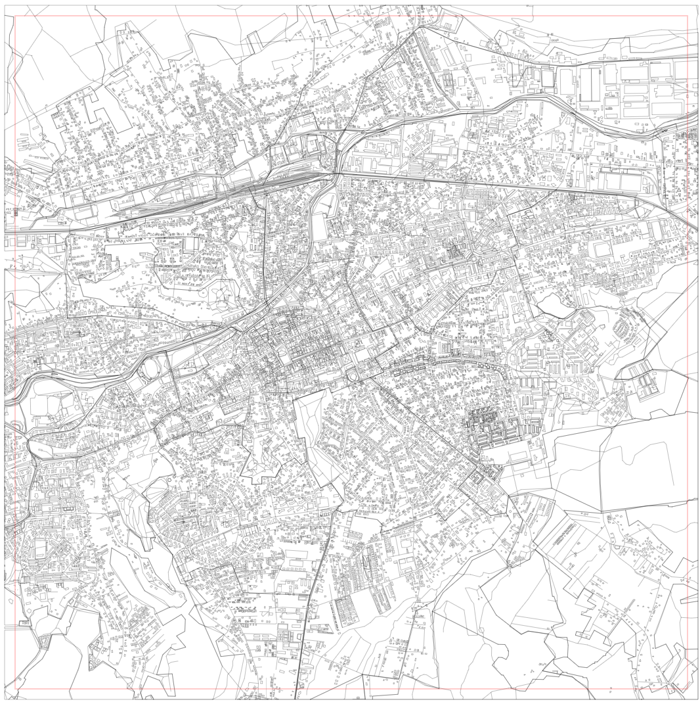

# Vector Tile PBF viewer

The tool helps you plot one pbf file containing data encoded with [Mapbox Vector Tile specification](https://github.com/mapbox/vector-tile-spec)

Data from PBF is plotted on a canvas.


{ width=50% }


## Project setup
```
npm install
```

### Compiles and hot-reloads for development
```
npm run serve
```

### Compiles and minifies for production
```
npm run build
```

### Lints and fixes files
```
npm run lint
```
